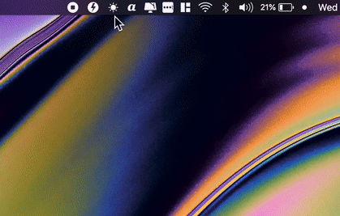

# night-shift-slider
A simple macOS menu bar widget for quickly adjusting the native Night Shift color temperature.

- Works on macOS >= Sierra 10.12.4

__Usage__
   - Download Night Shift Slider.app from [releases](https://github.com/fredericocurti/night-shift-slider/releases)
or build it with Xcode

**-- the temperature change isn't recordable**

- Thanks to [@jenghis](https://github.com/jenghis) for the inspiration and usage of the CoreBrightness API

