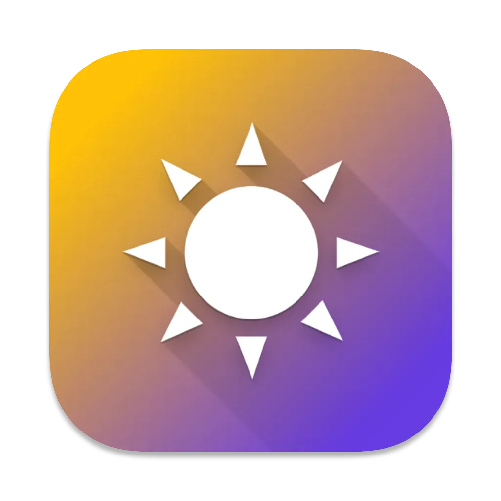

#  Night Shift Slider

A simple macOS menu bar widget for quickly adjusting the native Night Shift color temperature.

**Update 2024:**

- Release 2.0.0 - Added Apple Silicon support

## Usage

Download **Night Shift Slider.app** from [releases](https://github.com/fredericocurti/night-shift-slider/releases) and drag it to Applications folder or build it with Xcode

 

> The temperature change isn't recordable

_Works on macOS >= Big Sur_

### Credits

Thanks to [@jenghis](https://github.com/jenghis) for the inspiration and usage of the CoreBrightness API
